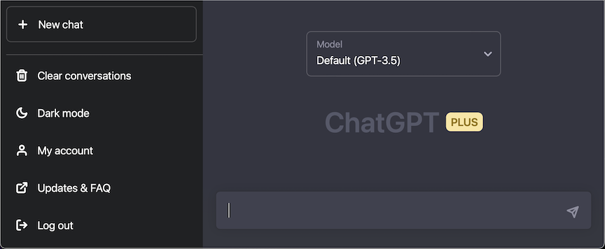

# README

Build Connect 4 game in Haskell using OpenAI GPT-4.

## Purpose

The purpose of this exercise is to *explore how easy it is to use GPT-4 (will be called "the AI" in the following text) to partner with you to rapidly prototype a real Haskell implementation of the **[Connect 4](https://en.wikipedia.org/wiki/Connect_Four) game**.*

Initially I intended to try the following discrete AI commands:

1. Generate a Haskell *programmed solution* for **Connect 4**.  What would code look like?
2. Generate a Haskell *module* to create a *console* user interface using the module generated in step 1.
3. Generate a Haskell module to create a *GUI* using the module generated in step 1.
4. Generate a Haskell test file to run unit tests against the module generated in step 1.

## Questions I had before starting

* Would I get a useful response to a very general request for my first AI request?
* Would I be able to iterate easily to add functionality missed by previous AI requests?
* Would there be any `stack` build assistance?
* Would the generated Haskell source file(s) compile?
* Would the program build?
* Would the program launch successfully?
* Would the program behave correctly while running it?
* Were the features representative of what the AI promised?

## Implementation

I decided to start before reading any OpenAI documentation.  Jump feet first.  Just how user friendly is the AI?

## Preparation

I signed up for the GPT-3.5 service first, and launched my first Chat window:

1. Browsed [Open AI](https://openai.com).  I used **Safari**[^1].
1. Clicked the button [Learn about GPT-4](https://openai.com/product/gpt-4).
1. Clicked [Try on ChatGPT Plus](http://chat.openai.com/).
1. Observed the GPT "chat" window which looks like this:
    

## My First Chat Commmand

I typed the following command into the chat window (turned out to be for GPT 3.5):

`Generate the source code for using Haskell to implement the "connect 4" game`

After a few seconds, it responded:

### The Chat Response

`Sure, here's a possible implementation of the Connect 4 game in Haskell:`

---

```text
import Data.List (transpose)

-- Define the players
data Player = Red | Yellow
  deriving (Eq, Show)

-- Define the board as a matrix of players
type Board = [[Maybe Player]]

-- Define the dimensions of the board
numRows :: Int
numRows = 6

numCols :: Int
numCols = 7

-- Define the initial empty board
emptyBoard :: Board
emptyBoard = replicate numRows (replicate numCols Nothing)

-- Define a function to print the board
printBoard :: Board -> IO ()
printBoard board = putStrLn $ unlines $ map (concatMap showPlayer) board
  where
    showPlayer Nothing = "⚪"
    showPlayer (Just Red) = "🔴"
    showPlayer (Just Yellow) = "🟡"

-- Define a function to check if a player has won
hasWon :: Player -> Board -> Bool
hasWon player board =
  checkRows || checkColumns || checkDiagonals
  where
    checkRows = or $ map (checkLine player) board
    checkColumns = or $ map (checkLine player) (transpose board)
    checkDiagonals = or $ map (checkLine player) (diagonals board)

-- Define a function to check if a line of players contains a winning sequence
checkLine :: Player -> [Maybe Player] -> Bool
checkLine player line =
  any (== sequence) (map (take 4) (windows line))
  where
    sequence = replicate 4 (Just player)

-- Define a function to generate all the diagonals of the board
diagonals :: Board -> [[Maybe Player]]
diagonals board =
  let topHalf = map (\i -> [row !! j | row <- take i board | j <- [0..numCols-1], i-1 >= j, j >= 0]) [1..numRows]
      bottomHalf = map (\j -> [row !! j | row <- drop j board | i <- [0..numRows-1], i+j < numCols]) [0..numCols-1]
  in topHalf ++ bottomHalf

-- Define a function to generate all the windows of size n from a list
windows :: [a] -> [[a]]
windows list = map (take n) (dropWhile ((< n) . length) (iterate tail list))
  where
    n = 4

-- Define a function to place a player's piece in a column
placePiece :: Player -> Int -> Board -> Maybe Board
placePiece player col board
  | col < 0 || col >= numCols = Nothing
  | otherwise = case dropWhile isNothing (transpose board !! col) of
                  [] -> Nothing
                  (Nothing : row) -> Just $ replaceRowAt col (Just player) board
                  _ -> Nothing

-- Define a function to replace a row in a matrix
replaceRowAt :: Int -> a -> [[a]] -> [[a]]
replaceRowAt n x xs = take n xs ++ [replaceAt (xs !! n)] ++ drop (n+1) xs
  where
    replaceAt row = take n row ++ [x] ++ drop (n+1) row

-- Define a function to play the game
playGame :: IO ()
playGame = do
  -- Initialize the game with an empty board and the Red player starting
  let initState = (emptyBoard, Red)
  playTurn initState

-- Define a function to play a turn
playTurn :: (Board, Player) -> IO ()
playTurn (
```

---

### Failure

What happened?  The last function, `playTurn` wasn't compledted.

### Cause of Failure

After much poking around, I checked the **[ChatGPT Statistics for 2023](https://www.demandsage.com/chatgpt-statistics/)**.  Under the section **ChatGPT Statistics At A Glance** (down about a quarter of the page), there is the following item **13**:

> *ChatGPT can only fetch data prior to the year 2021, as its **training stopped in the year 2021**.*

### Consequences

First of all, this means that we have to only depend upon code that existed in 2020 or earlier.  The easiest way to accomplish this in Haskell is to specify that the Haskell **resolver** to the last standard release in 2020.  This I looked up in the **[stack documentation](https://www.stackage.org)** where clicking on **[lts-16.11](https://www.stackage.org/lts-16.11)** reveals it was published on **2020-08-25**.

## My First Chat Commmand (Again)

This time we'll make sure that all code that we use has been included in the GPT database.  The safest approach is to bake in the correct **resolver** by creating the Haskell project with the following commands:

``` bash

```

---

## Links

[^1]: I'll note that Safari wasn't (to my knowledge) responsible for any of the problems I would encounter.
